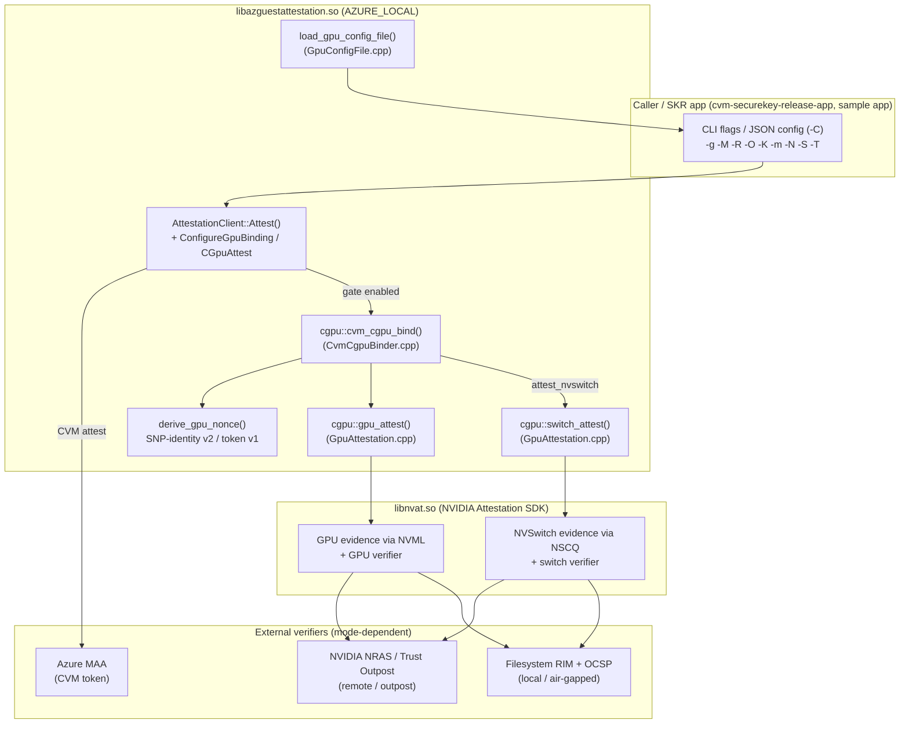
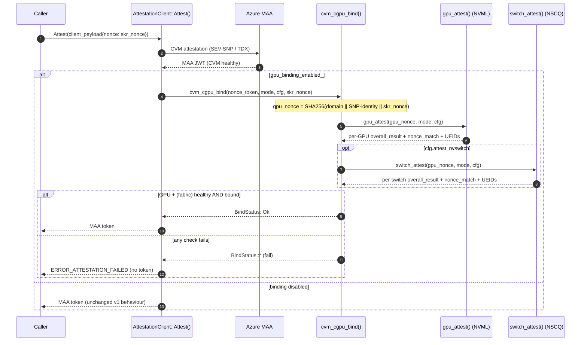

# Confidential GPU (CGPU) Attestation & Binding — Architecture

> Status: **Implemented** (Azure Local / `AZURE_LOCAL` build).
> Audience: SDK maintainers, attestation/security engineers, SKR integrators.
>
> This document describes the *as-built* CGPU support added to the Azure CVM
> Guest Attestation client library: how the NVIDIA Attestation SDK (NVAT) is
> wrapped, how a GPU (and optionally the NVLink/NVSwitch fabric) is bound to the
> CVM that requested it, the public API, the config-file/secrets
> model, the build, and the sample app.
---

## 1. What this adds

- A thin, RAII C++ wrapper (`cgpu::`) over the NVAT C API that:
  - collects GPU evidence over **NVML** and verifies it (remote / local / outpost),
  - optionally collects **NVLink/NVSwitch** fabric evidence over **NSCQ** and
    verifies it (HGX / Blackwell-NVL systems),
  - parses the verifier claims into a small, stable result struct.
- A **CVM↔CGPU binder gate** (`cvm_cgpu_bind`) that ties the attested GPU(s)
  and fabric to *this* CVM launch via a derived nonce, and fails closed.
- An opt-in hook inside `AttestationClient::Attest()` (`AZURE_LOCAL` only) that
  runs the gate **after** a successful CVM attestation and **before** the token
  is returned — so a downstream Secure Key Release (SKR) never proceeds unless
  the GPU is healthy *and* bound.
- A JSON **config file** with **secrets-via-file** (NRAS key never on the
  command line), CLI overrides, and forward-compatible NVSwitch knobs.
- A standalone **sample app** (`cgpu-attestation-test-app`) exercising every
  flavour.

Everything new is compiled **only** under `AZURE_LOCAL`. The default build and
all v1 `Attest()` callers are byte-for-byte unaffected.

---

## 2. Components and files changed

### 2.1 New files

| File | Purpose |
|------|---------|
| `client-library/src/Attestation/AttestationClient/lib/include/GpuAttestation.h` | `cgpu::GpuMode`, `GpuConfig`, `GpuResult`, `GpuConfigFile`; declares `gpu_attest`, `switch_attest`, `load_gpu_config_file`. |
| `client-library/src/Attestation/AttestationClient/lib/GpuAttestation.cpp` | NVAT wrapper: GPU evidence (NVML) + NVSwitch evidence (NSCQ) collection & verification; claims parsing; shared verifier builders. |
| `client-library/src/Attestation/AttestationClient/lib/include/CvmCgpuBinder.h` | `cgpu::BindStatus`, `cvm_cgpu_bind` (the gate). |
| `client-library/src/Attestation/AttestationClient/lib/CvmCgpuBinder.cpp` | Binding-nonce derivation (SNP-identity v2 / fallback v1) + GPU & NVSwitch gate logic. |
| `client-library/src/Attestation/AttestationClient/lib/GpuConfigFile.cpp` | JSON config loader, `service_key_file` (secrets-via-file). |
| `cgpu-attestation-test-app/` | Standalone sample app (`main.cpp`, `Logger.*`, `CMakeLists.txt`, `README.md`). |

### 2.2 Modified files

| File | Change |
|------|--------|
| `client-library/src/Attestation/AttestationClient/lib/include/AttestationClient.h` | `AZURE_LOCAL` virtuals: `ConfigureGpuBinding`, `CGpuAttest`, `GetLastGpuResult`; includes the two CGPU headers. |
| `client-library/src/Attestation/AttestationClient/lib/AttestationClientImpl.{h,cpp}` | Binding gate inside `Attest()` (post-CVM, pre-return); `ConfigureGpuBinding` / `CGpuAttest` / `GetLastGpuResult` implementations; `last_gpu_result_` state. |
| `client-library/src/Attestation/AttestationClient/lib/DynamicLibrary/CMakeLists.txt` | Finds NVAT via `NVAT_ROOT`; compiles `GpuAttestation.cpp`, `GpuConfigFile.cpp`, `CvmCgpuBinder.cpp`; links `${NVAT_LIBRARY}`. |
| `client-library/src/Attestation/AttestationClient/tests/lib/CMakeLists.txt` | Compiles the three CGPU sources into the gtest target. |
| `cvm-securekey-release-app/Main.cpp` | CLI flags `-g -M -R -O -K -m -N -S -T -C`; config-file precedence + CLI override wiring. |
| `cvm-securekey-release-app/AttestationUtil.{h,cpp}` | `g_gpu_*` globals; `PrintGpuBindingDetails` (per-GPU + NVSwitch detail). |

---

## 3. Architecture



**Key design fact:** NVAT's high-level `nvat_attest_device` (and
`set_device_type`) attests a **GPU population _or_ an NVSwitch population per
call** — the two device classes are mutually exclusive in one context. A full
HGX/NVL system therefore needs **two passes**, which is why `gpu_attest` and
`switch_attest` are separate and the binder runs both with the *same* nonce.

---

## 4. The binding gate flow

The binding protocol is **MAA-agnostic**: the CVM token already exists before the GPU nonce
is derived, so there is no circular dependency. The gate ties the GPU(s)/fabric
to *this* CVM launch and fails closed.



---

## 5. The binding nonce

`derive_gpu_nonce()` (in [`CvmCgpuBinder.cpp`](../client-library/src/Attestation/AttestationClient/lib/CvmCgpuBinder.cpp))
binds the GPU evidence to the CVM identity. It parses the MAA JWT and prefers
the **stable** SEV-SNP launch identity over the whole opaque token:

```
v2 (SEV-SNP CVMs):
  gpu_nonce = SHA256( "cgpu-binding-v2"
                      || x-ms-sevsnpvm-launchmeasurement
                      || x-ms-sevsnpvm-reportid
                      || x-ms-sevsnpvm-hostdata
                      || skr_nonce )

v1 (fallback, e.g. TDX / claims absent):
  gpu_nonce = SHA256( "cgpu-binding-v1" || nonce_token || skr_nonce )

attest-only (GpuConfig::bind == false; no CVM tie):
  gpu_nonce = SHA256( "cgpu-nobind-v1" || skr_nonce )
```

> **Bind vs. attest-only (`GpuConfig::bind`, default `true`).** With `bind`
> the nonce encodes the CVM identity (v2/v1) and the gate requires the GPU(s) to
> echo it, proving the GPU is bound to *this* CVM. With `bind = false` (SKR `-b`)
> the GPU is still collected and verified for genuineness/health, but the nonce
> is freshness-only — the CVM and GPU are attested **independently**, with no
> cross-binding, and no CVM token is consumed. A failed/unhealthy GPU still fails
> closed in both modes; only the binding (nonce-match) checks are skipped.

- **Why v2:** the JWT also carries volatile fields (`iat`/`exp`/`jti`, the
  issuer signature, the `kid`) that change on every issuance and say nothing
  about *which* CVM this is. Binding to the parsed launch measurement +
  per-launch report id ties the GPU to the specific CVM launch deterministically.
- **`skr_nonce`** (optional, from `client_payload {"nonce": "..."}`) adds
  per-request freshness / domain separation.
- The SNP claims live under the nested `x-ms-isolation-tee` object; if
  `launchmeasurement` is absent the code falls back to v1.
- The nonce-match check is **self-consistent**: the binder sends `gpu_nonce`,
  the GPU echoes it in its signed report, and the verifier surfaces a
  per-device nonce-match claim that the gate requires.

---

## 6. Multi-GPU and NVLink/NVSwitch (HGX / Blackwell-NVL)

NVAT always collects **every** GPU/switch present; the gate decides how strictly
to treat the population.

### GPU gate
- **single** (default): GPU 0 must be healthy and echo the nonce (`nonce_match`).
- **multi** (`GpuConfig::multi_gpu`): **every** collected GPU must be healthy and
  nonce-bound — `num_gpus_bound == num_evidences`, so an unbound/stolen GPU among
  the others fails the gate.
- **`expected_gpu_count > 0`**: pins the population so a hidden/missing GPU can't
  shrink the attested set.

### NVSwitch fabric gate (`GpuConfig::attest_nvswitch`)
When enabled, the binder runs a **second** pass, `switch_attest`, with the same
`gpu_nonce`, covering the encrypted NVLink interconnect:
- NSCQ enumerates every NVSwitch; the switch verifier appraises each.
- Leg-2 checks: `switch_overall_result` must be true, every switch must be
  nonce-bound (`num_switches_bound == num_switches`), and `expected_switch_count`
  optionally pins the count.
- **Fail-closed:** enabling the fabric gate on a box with no NVSwitch/NSCQ
  surfaces an NVAT error (e.g. `NVAT_RC_NSCQ_INIT_FAILED`) → `BindStatus::SwitchCollectOrVerifyFailed`,
  so you cannot silently "pass" a fabric gate on hardware that has no fabric.

`BindStatus` values: `Ok`, `GpuCollectOrVerifyFailed`, `GpuUnhealthy`,
`NotBound`, `GpuCountMismatch`, `SwitchCollectOrVerifyFailed`, `SwitchUnhealthy`,
`SwitchNotBound`, `SwitchCountMismatch`, `InternalError`.

---

## 7. Verifier modes

| Mode | Verifier | RIM / OCSP source | Network |
|------|----------|-------------------|---------|
| **remote** | NVIDIA NRAS cloud | NVIDIA cloud defaults | yes |
| **local** | in-guest (in-process) | filesystem RIM dir + optional `file://` OCSP cache | no (air-gapped) |
| **outpost** | NVIDIA NRAS (cloud or on-prem appliance) | on-prem NVIDIA Trust Outpost over http | yes (LAN) |

`remote` and `outpost` share the NRAS verifier; they differ only in *where*
RIM/OCSP are fetched. The GPU and NVSwitch verifiers share the same
`resolve_inputs()` / `build_local_stores()` helpers (service key, NRAS URL,
Trust Outpost env steering, filesystem RIM/OCSP).

---

## 8. Public API (`AZURE_LOCAL` only)

From [`AttestationClient.h`](../client-library/src/Attestation/AttestationClient/lib/include/AttestationClient.h):

```cpp
// Configure the gate once.
virtual void ConfigureGpuBinding(bool enabled,
                                 cgpu::GpuMode mode,
                                 const cgpu::GpuConfig& cfg) noexcept = 0;

// GPU counterpart of Attest(): attest + bind given an existing CVM token.
virtual attest::AttestationResult CGpuAttest(const std::string& nonce_token,
                                             const std::string& skr_nonce,
                                             cgpu::GpuResult* out_result) noexcept = 0;

// Fetch the last GPU/binding result (also populated by Attest() when the gate runs).
virtual bool GetLastGpuResult(cgpu::GpuResult* out_result) noexcept = 0;
```

Two usage patterns:

1. **Gated `Attest()`** — call `ConfigureGpuBinding(true, mode, cfg)` first; the
   gate then runs automatically inside `Attest()` after the CVM token is obtained
   and before it is returned. This is what the SKR app uses so key release is
   gated.
2. **Explicit `CGpuAttest()`** — get an MAA token (binding disabled), then call
   `CGpuAttest(token, skr_nonce, &result)` yourself. The token is used only
   locally to derive the binding nonce. This is what the sample
   app's `-t bind` uses.

Low-level `cgpu::` API ([`GpuAttestation.h`](../client-library/src/Attestation/AttestationClient/lib/include/GpuAttestation.h)):

```cpp
GpuResult gpu_attest(const uint8_t nonce[32], GpuMode mode, const GpuConfig& cfg);
void      switch_attest(const uint8_t nonce[32], GpuMode mode, const GpuConfig& cfg, GpuResult& result);
bool      load_gpu_config_file(const std::string& path, GpuConfigFile& out, std::string* error);
// + cgpu::cvm_cgpu_bind(...) in CvmCgpuBinder.h
```

---

## 9. Config file & secrets-via-file

`load_gpu_config_file()` parses an operator-pinned JSON policy. The **`-C`** flag
loads it as the *base* policy; CLI flags then override individual fields. The
key security win is `service_key_file`: the NRAS key is read from a file path
(trimmed, size-capped) so it **never appears in `argv` / `/proc/<pid>/cmdline`**.

```json
{
  "enabled": true,
  "mode": "remote",
  "bind": true,
  "multi_gpu": true,
  "expected_gpu_count": 8,
  "attest_nvswitch": true,
  "expected_switch_count": 4,
  "nras_url": "",
  "rim_dir": "",
  "ocsp_dir": "",
  "rim_uri": "",
  "ocsp_uri": "",
  "service_key": "",
  "service_key_file": "/etc/azure-cgpu/nras.key"
}
```

- `service_key_file` (a path) takes precedence over inline `service_key`.
- Unknown fields are ignored; absent fields keep their defaults.
- CLI precedence: config file = base, CLI overrides. Mode/endpoint remap from the
  CLI only runs when no `-C` is given **or** `-M` is explicitly passed.

---

## 10. Build

CGPU support requires the **`AZURE_LOCAL`** build, which links NVAT. Point
`NVAT_ROOT` at your NVAT install prefix (the one containing `include/nvat.h` and
`lib/libnvat.so`).

```bash
cd confidential-computing-cvm-guest-attestation/cvm-attestation-sample-app

# One-time prerequisites (edge-cc-base-attestation-sdk, libtss2-dev, ...):
#   sudo ../client-library/src/Attestation/pre-requisites-azure-local.sh

export NVAT_ROOT=/opt/nvat            # adjust to your NVAT install prefix
./ClientLibBuildAndInstallAzureLocal.sh
```

This builds `libazguestattestation.so` with `AZURE_LOCAL`, installs the
`azguestattestation1` `.deb` (headers under `/usr/include/azguestattestation1/`,
the `.so` under `/usr/lib/`), and compiles `GpuAttestation.cpp`,
`GpuConfigFile.cpp`, and `CvmCgpuBinder.cpp` into the shared library.

> **NVAT / OpenSSL note:** NVAT statically embeds its own OpenSSL. Build NVAT
> with `--exclude-libs,ALL -Bsymbolic` so it does not export and interpose the
> system OpenSSL that libcurl uses (otherwise the SKR app can crash in
> `curl_easy_init`). See the repo memory note `cgpu-nvat-openssl.md`.

---

## 11. Sample app (`cgpu-attestation-test-app`)

A tiny standalone harness ([`cgpu-attestation-test-app/`](../cgpu-attestation-test-app/))
that links only `<AttestationClient.h>` + the stdlib and exercises every flavour.

| `-t`   | Flow | API |
|--------|------|-----|
| `cvm`  | CVM-only MAA attestation (no GPU) | `Attest()` |
| `gpu`  | CGPU attestation only, no CVM binding | `cgpu::gpu_attest()` |
| `bind` | CVM attestation + CGPU binding | `Attest()` then `CGpuAttest()` |

```bash
cd confidential-computing-cvm-guest-attestation/cgpu-attestation-test-app
mkdir -p build && cd build
cmake .. && make -j

# Plain CVM attestation (no GPU)
sudo ./cgpu-attest-test -t cvm

# CGPU only, single GPU, NRAS cloud verifier
sudo ./cgpu-attest-test -t gpu -M remote

# CGPU only, all GPUs, fully in-guest (air-gapped)
sudo ./cgpu-attest-test -t gpu -M local -R /opt/rim -O /opt/ocsp -m

# CVM attestation + bind all 8 GPUs to this CVM
sudo ./cgpu-attest-test -t bind -M remote -m -N 8

# Verbose: detached EAT (JWT) + full claims JSON
sudo ./cgpu-attest-test -t gpu -M remote -v
```

Exit codes: `0` pass, `1` attestation/binding failed, `2` bad arguments.

> The sample app currently exposes the GPU/multi-GPU flags; the NVSwitch flags
> (`-S`/`-T`) are wired in the SKR app (`cvm-securekey-release-app`). They can be
> added to the sample app the same way if a standalone fabric test is needed.

---

## 12. SKR app CLI reference (`cvm-securekey-release-app`)

CGPU flags (all `AZURE_LOCAL`), used to gate Secure Key Release on a healthy,
bound GPU/fabric:

| Flag | Meaning |
|------|---------|
| `-g` | Enable CGPU binding (gate AKV on GPU attestation) |
| `-b` | Attest the GPU but do **not** bind it to this CVM (CVM and GPU attested independently; default binds) |
| `-M <mode>` | Verifier mode: `remote` \| `local` \| `outpost` (default `remote`) |
| `-R <path\|uri>` | RIM source: RIM dir (local) or Trust Outpost RIM URL (outpost) |
| `-O <path\|uri>` | OCSP source: cache dir (local) or Trust Outpost OCSP URL (outpost) |
| `-K <key>` | NRAS service key (remote/outpost; or env `NVAT_SERVICE_KEY`) — prefer `service_key_file` |
| `-m` | Multi-GPU: require **every** GPU bound |
| `-N <count>` | Require exactly `<count>` GPUs present (0 = any) |
| `-S` | Also attest the NVLink/NVSwitch fabric |
| `-T <count>` | Require exactly `<count>` NVSwitches present (0 = any) |
| `-C <file>` | Load JSON config (base policy; CLI overrides; enables `service_key_file`) |

The gate runs after CVM attestation and before AKV; on any non-`Ok` `BindStatus`
the key is not released. `PrintGpuBindingDetails` (with `-V`) shows the derived
nonce, per-GPU bound/total + UEIDs, and the NVSwitch section when `-S` is used.

---

## 13. Security properties

- **Bound, not adjacent.** A stolen GPU EAT for a different CVM cannot pass: the
  GPU must echo the nonce derived from *this* CVM's SNP launch identity.
- **All-or-nothing population.** Multi-GPU and NVSwitch gates require every
  collected device to be healthy and bound; optional count pins detect a
  missing/hidden device.
- **Fail-closed.** Any collection/verify error, unhealthy result, nonce
  mismatch, or count mismatch returns an error and **no token / no key release**.
- **Secrets off the command line.** `service_key_file` keeps the NRAS key out of
  `argv` / `/proc/<pid>/cmdline`.
- **Zero blast radius when disabled.** All new code is `AZURE_LOCAL`-gated and
  only runs when binding is explicitly enabled; v1 behaviour is unchanged.

### Out of scope
- Proving physical PCIe attachment (requires PCIe IDE / TDISP).
- Replacing AKV / mHSM — SKR is a *consumer* of the gate, not part of it.
- Modifying NVAT itself.
