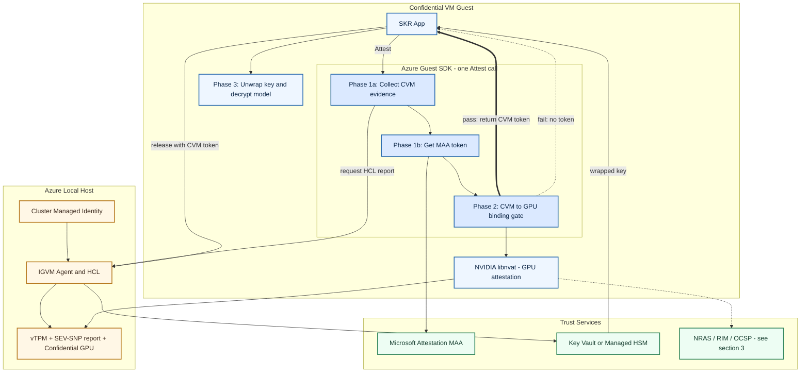
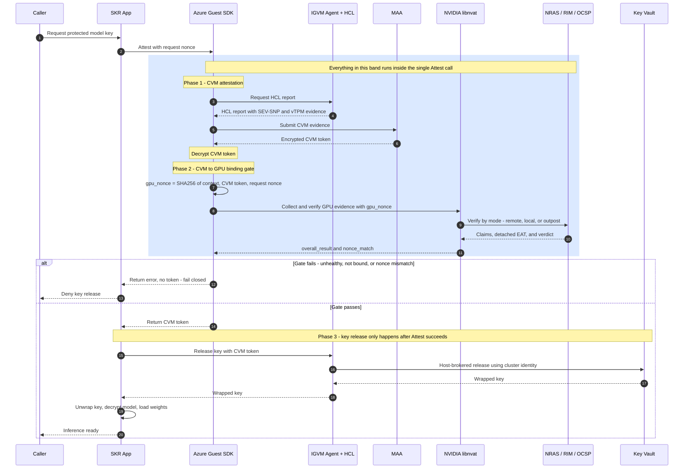
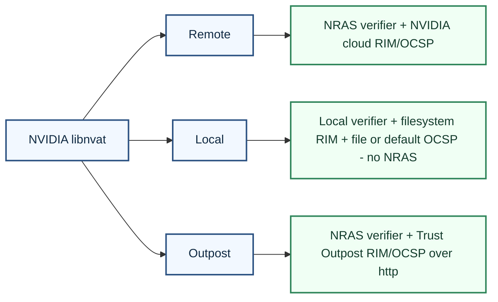

# CVM + CGPU Bounded SKR Architecture

This page describes the production architecture for CVM-gated and CGPU-bound Secure Key Release (SKR) for AI model protection.

Scope assumptions used here:
- Real Azure Key Vault / Managed HSM release path.
- Azure Local host-brokered release via IGVM agent and cluster identity.
- CVM attestation is performed through the Azure guest attestation SDK.
- GPU binding is enforced by the integrated NVIDIA attestation path before key release.

## At a glance

The whole flow is three phases, and a key is only released if all of them pass:

1. **Phase 1 - CVM attestation** (inside the SDK `Attest()` call): the SDK gets the HCL report from the host, sends the evidence to MAA, and gets back a signed CVM token.
2. **Phase 2 - CVM-to-GPU binding gate** (still inside the same `Attest()` call): the SDK derives a GPU nonce from the CVM token, drives NVIDIA libnvat to attest the GPU, and checks health and nonce match. If this fails, `Attest()` returns **no token** (fail closed).
3. **Phase 3 - key release** (back in the SKR app, only after `Attest()` succeeds): the app releases the wrapped key from Key Vault (host-brokered on Azure Local), unwraps it, and decrypts the model.

The single most important point: **the binding gate runs inside the SDK, before any token exists, so no token means no key release.**

---

## 1) System Context (Architecture)

### Flow summary
1. The SKR app makes a single `Attest()` call into the Azure guest attestation SDK.
2. Inside that call, the SDK collects CVM evidence by asking the IGVM agent and HCL for the HCL report, which carries the SEV-SNP hardware report and vTPM evidence.
3. The SDK submits that evidence to MAA and decrypts the returned CVM token.
4. Still inside the same call, the CVM to CGPU binding gate runs: it derives the GPU nonce from the CVM token plus the request nonce, drives NVIDIA libnvat to attest the GPU, and checks the verdict, GPU health, and nonce match.
5. If the gate fails the call returns no token (fail closed). Only on success does `Attest()` return the CVM token.
6. The SKR app, now holding a valid CVM token, releases the key from Azure Key Vault (host-brokered through the IGVM agent and cluster identity on Azure Local), then unwraps it and decrypts the model.

### Trust boundaries
- Guest trust boundary: the SKR app, the Azure guest SDK (including the binding gate), libnvat, and key handling run inside the CVM.
- Host trust boundary: the IGVM agent and HCL provide hardware evidence and broker the MAA and AKV calls using cluster identity.
- External trust boundary: MAA, AKV, and NVIDIA collateral/verifier services.

---

## 2) End-to-End Key Release and Model Load Flow

---

## 3) Attestation Modes and Service Contact Paths

The binding gate (Phase 2) drives NVIDIA libnvat, which can verify GPU evidence in three modes. All three share the same fail-closed gate; they differ only in which verifier appraises the evidence and where the RIM and OCSP collateral come from.

| Aspect | Remote | Local | Outpost |
|---|---|---|---|
| Verifier | NVIDIA NRAS (cloud) | In-guest local verifier | NVIDIA NRAS (cloud or on-prem appliance) |
| RIM source | NVIDIA cloud defaults | Local filesystem directory | On-prem Trust Outpost mirror (http) |
| OCSP source | NVIDIA cloud defaults | `file://` cache dir or NVIDIA default | On-prem Trust Outpost mirror (http) |
| Contacts NRAS? | Yes | No - fully air-gapped | Yes |
| Best used when | Internet path to NVIDIA is available | No outbound connectivity at all | NRAS reachable, but collateral served on-prem |

---

## 4) Control Objectives Captured by the Architecture

- Fail-closed release policy: no key release unless CVM attestation and CGPU binding both pass.
- Replay resistance for GPU binding: nonce is derived from CVM token plus request nonce and validated via nonce_match.
- Separation of duties: guest enforces policy and binding; host broker performs managed-identity key release.
- Pluggable attestation topology: remote, local, and outpost modes share the same SKR control gate.
